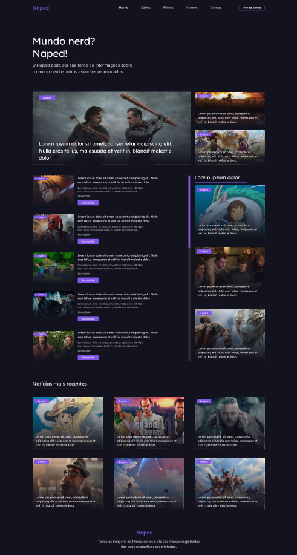

# Codelândia 10º

	

## Sobre   
Este projeto foi desenvolvido para o 10º desafio da comunidade **[Codelândia](https://discord.com/invite/QevDJqCzaY)**. O objetivo dele era **praticar Front-end** desenvolvendo um simples Naped  **semântico** e **responsivo**.

(O Naped  pode ser uma fonte das tuas informações sobre o mundo nerd e outros assuntos relacionados.)

---

## Ferramentas e Tecnologias
- **HTML5**
- **CSS3**
- **SCSS** 

---

## Layout
Layout do site no link abaixo:
- **[Figma](https://www.figma.com/file/Yb9IBH56g7T1hdIyZ3BMNO/Desafios-Codelândia?node-id=15409%3A2)**

---

**Desenvolvido com ❤ por [Gerson Lamela](https://github.com/gersonlamela).**